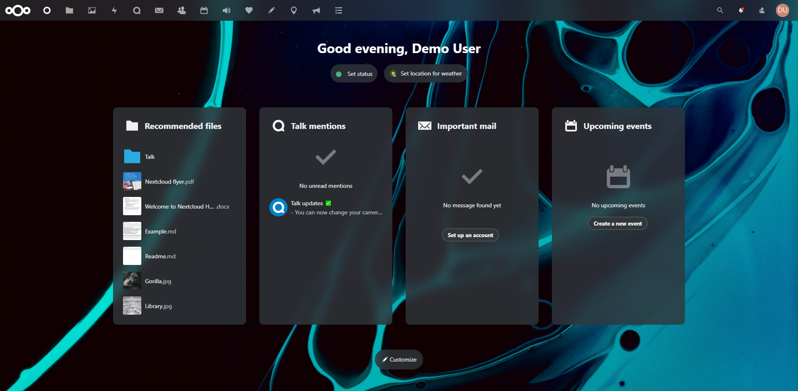

# Concept Dark Theme

This is the Concept Dark Theme for [Nextcloud](https://nextcloud.com), providing a dark sleek and modern acrylic interface with dark sleek look.



## Credits

This theme is based on the [Breeze Dark Theme](https://github.com/mwalbeck/nextcloud-breeze-dark) by [Magnus Walbeck](https://github.com/mwalbeck).
Credits for the backend of this theme, as well as the basic template of the theme's styling goes to him.

## Supported versions

The currently supported and maintained Nextcloud releases are:

-   Nextcloud 20

## Installation

Currently, the only installation option is to clone the repository to the `apps` directory.

Nextcloud market release is due.

## Usage

AFter installation, the app needs to be enabled and activated for the theme to show up.

#### Global

The global option is used as the default for new users, existing users without configuration, and unauthenticated pages such as the login page.

Without enabling this option, pages like the login page will not be themed.

The global option can be managed in the below page.

```
Admin settings > Theming > Concept Dark
```

#### Personal

The personal option is used to configure the theme for individual users.

This setting will override the global setting for the individual user.

The personal option can be managed in the below page.

```
Personal settings > Accessibility > Concept Dark
```

## Contributions

### Issues

If you find an issue with the theme, please report the issue on github [issues](https://github.com/hahagu/nextcloud_concept_dark/issues).

## Donations

If you like the theme and would like to donate, please do so using the below method(s). :

**PayPal:**  
https://www.paypal.me/hahagu

Thanks for your support!
